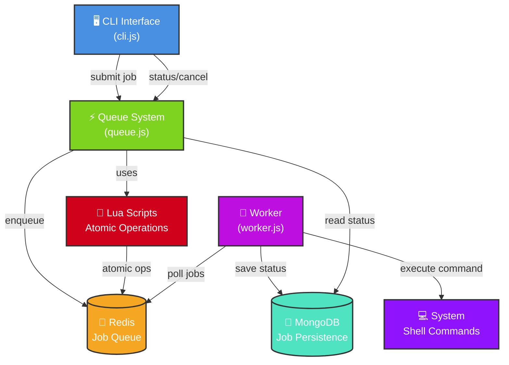

# Synq

A lightweight, Redis-backed job queue system for command execution with MongoDB persistence.

## Features

- **🚀 Job Queue System** - Submit, track, and execute shell commands asynchronously
- **⚡ Redis Backend** - Fast job queuing and atomic operations via Lua scripts
- **💾 MongoDB Persistence** - Job status and execution history storage
- **🔄 Worker Processing** - Background workers execute queued commands
- **❌ Job Cancellation** - Cancel jobs before or during execution
- **🔍 Status Tracking** - Real-time job status monitoring
- **🧪 Race Condition Safe** - Atomic operations prevent concurrent processing issues

## Quick Start

### Prerequisites
```bash
# Redis and MongoDB running locally or add your production URIs
redis-server
mongodb
```

### Installation

#### Option 1: Install as npm package
```bash
npm install synqjs
```

#### Option 2: Local development
```bash
git clone <repository-url>
cd synq
npm install
```

### Usage

There are **three ways** to use the Synq queue system:

#### Method 1: CLI Interface (Command Line)

##### Submit a Job
```bash
node src/cli.js submit "echo Hello World"
```

##### Check Job Status
```bash
node src/cli.js status job-1234567890
```

##### Cancel a Job
```bash
node src/cli.js cancel job-1234567890
```

#### Method 2:  Programmatic Function Calls (JavaScript/Node.js)

You can also use the queue system directly in your JavaScript/Node.js applications by importing the functions:

```javascript
import { submitJob, getJobStatus, cancelJob } from "./src/queue.js";

// Submit a job programmatically
await submitJob("echo Hello from script");

// Check job status
await getJobStatus("job-1234567890");

// Cancel a job
await cancelJob("job-1234567890");
```

##### Example Script
```javascript
// example-script.js
import { submitJob } from "./src/queue.js";

async function runBatchJobs() {
  // Submit multiple jobs
  await submitJob("echo Processing file 1");
  await submitJob("echo Processing file 2");
  await submitJob("ls -la");
  
  console.log("All jobs submitted!");
}

runBatchJobs().catch(console.error);
```

#### Method 3: Hybrid Approach (CLI + Programmatic)

You can combine both methods in your workflow - use scripts for batch operations and CLI for manual management:

```javascript
// batch-processor.js
import { submitJob } from "./src/queue.js";

async function processBatch() {
  const tasks = [
    "python data_processor.py --file=data1.csv",
    "python data_processor.py --file=data2.csv", 
    "python data_processor.py --file=data3.csv"
  ];
  
  // Submit jobs programmatically
  for (const task of tasks) {
    await submitJob(task);
  }
  
  console.log(`✅ Submitted ${tasks.length} batch jobs`);
}

processBatch().catch(console.error);
```

Then use CLI for monitoring and management:
```bash
# Run your batch script
node batch-processor.js

# Monitor jobs via CLI
node src/cli.js status job-1234567890

# Cancel a job if needed
node src/cli.js cancel job-1234567890
```

#### Start Worker (Required for all methods)
```bash
node src/worker.js
```

## Architecture



### Components

- **CLI** - Command-line interface for job management
- **Queue** - Redis-based job queuing with Lua scripts
- **Worker** - Background job processor
- **Databases** - Redis for queuing, MongoDB for persistence

## Testing

```bash
npm test           # Race condition tests
npm run test:load  # Load testing
```

## Configuration

Set environment variables:
- `REDIS_URL` - Redis connection (default: redis://localhost:6379)
- `MONGODB_URI` - MongoDB connection (default: mongodb://localhost:27017) 
