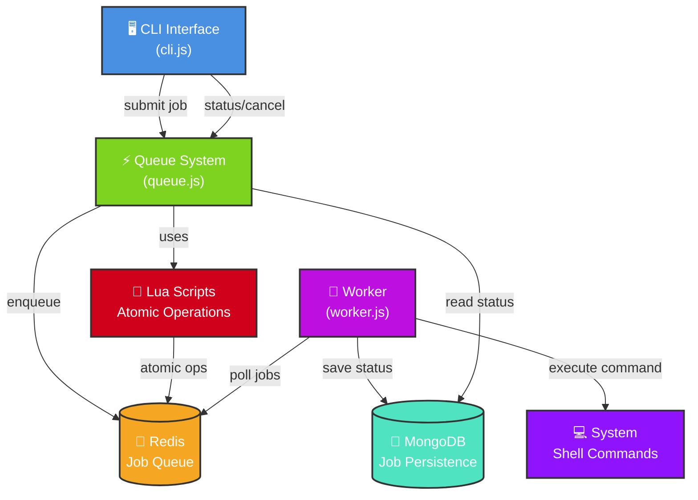

# Synq

A lightweight, Redis-backed job queue system for command execution with MongoDB persistence.

## Features

- **🚀 Job Queue System** - Submit, track, and execute shell commands asynchronously
- **⚡ Redis Backend** - Fast job queuing and atomic operations via Lua scripts
- **💾 MongoDB Persistence** - Job status and execution history storage
- **🔄 Worker Processing** - Background workers execute queued commands
- **❌ Job Cancellation** - Cancel jobs before or during execution
- **🔍 Status Tracking** - Real-time job status monitoring
- **🧪 Race Condition Safe** - Atomic operations prevent concurrent processing issues

## Quick Start

### Prerequisites
```bash
# Redis and MongoDB running locally or add your production URIs
redis-server
mongodb
```

### Installation
```bash
npm install
```

### Usage

#### Submit a Job
```bash
node src/cli.js submit "echo Hello World"
```

#### Check Job Status
```bash
node src/cli.js status job-1234567890
```

#### Cancel a Job
```bash
node src/cli.js cancel job-1234567890
```

#### Start Worker
```bash
node src/worker.js
```

## Architecture



### Components

- **CLI** - Command-line interface for job management
- **Queue** - Redis-based job queuing with Lua scripts
- **Worker** - Background job processor
- **Databases** - Redis for queuing, MongoDB for persistence

## Testing

```bash
npm test           # Race condition tests
npm run test:load  # Load testing
```

## Configuration

Set environment variables:
- `REDIS_URL` - Redis connection (default: redis://localhost:6379)
- `MONGODB_URI` - MongoDB connection (default: mongodb://localhost:27017) 