# Synq

A lightweight, Redis-backed job queue system for command execution with MongoDB persistence.

## Features

- **🚀 Job Queue System** - Submit, track, and execute shell commands asynchronously
- **⚡ Redis Backend** - Fast job queuing and atomic operations via Lua scripts
- **💾 MongoDB Persistence** - Job status and execution history storage
- **🔄 Worker Processing** - Background workers execute queued commands
- **❌ Job Cancellation** - Cancel jobs before or during execution
- **🔍 Status Tracking** - Real-time job status monitoring
- **🧪 Race Condition Safe** - Atomic operations prevent concurrent processing issues

## Quick Start

### Prerequisites
```bash
# Redis and MongoDB running locally or add your production URIs
redis-server
mongodb
```

### Installation

#### Option 1: Install as npm package
```bash
npm install synqjs
```

#### Option 2: Local development
```bash
git clone <repository-url>
cd synq
npm install
```

### Usage

There are **three ways** to use the Synq queue system:

#### Method 1: CLI Interface (Command Line)

The CLI can be used in multiple ways depending on how you install the package:

##### Global Installation  (Recommended)
```bash
# Install globally first
npm install -g synqjs

# Then use directly
synq submit "echo Hello World"
synq status job-1234567890
synq cancel job-1234567890
```

##### Local Installation with npx
```bash
# Install locally
npm install synqjs

# Use with npx (no global install needed)
npx synq submit "echo Hello World"
npx synq status job-1234567890
npx synq cancel job-1234567890
```

##### Direct node execution (Development)
```bash
node src/cli.js submit "echo Hello World"
node src/cli.js status job-1234567890
node src/cli.js cancel job-1234567890
```

#### Method 2:  Programmatic Function Calls (JavaScript/Node.js)

You can also use the queue system directly in your JavaScript/Node.js applications by importing the functions:

```javascript
import { submitJob, getJobStatus, cancelJob } from "./src/queue.js";

// Submit a job programmatically
await submitJob("echo Hello from script");

// Check job status
await getJobStatus("job-1234567890");

// Cancel a job
await cancelJob("job-1234567890");
```

##### Example Script
```javascript
// example-script.js
import { submitJob } from "./src/queue.js";

async function runBatchJobs() {
  // Submit multiple jobs
  await submitJob("echo Processing file 1");
  await submitJob("echo Processing file 2");
  await submitJob("ls -la");
  
  console.log("All jobs submitted!");
}

runBatchJobs().catch(console.error);
```

#### Method 3: Dashboard Monitoring

Monitor your jobs in real-time using the interactive dashboard:

```bash
# Start the dashboard
synq dashboard
# or for local development
node src/cli.js dashboard
```

The dashboard provides:
- **📊 Real-time Statistics** - Queue length, job counts by status
- **🔄 Live Updates** - Auto-refreshes every 2 seconds
- **📋 Job Details** - View currently running jobs and queue status
- **🎯 Visual Interface** - Clean, organized display of system state

#### Method 4: Hybrid Approach (CLI + Programmatic + Dashboard)

You can combine all methods in your workflow:

```javascript
// batch-processor.js
import { submitJob } from "./src/queue.js";

async function processBatch() {
  const tasks = [
    "python data_processor.py --file=data1.csv",
    "python data_processor.py --file=data2.csv", 
    "python data_processor.py --file=data3.csv"
  ];
  
  // Submit jobs programmatically
  for (const task of tasks) {
    await submitJob(task);
  }
  
  console.log(`✅ Submitted ${tasks.length} batch jobs`);
}

processBatch().catch(console.error);
```

Then use CLI and dashboard for monitoring:
```bash
# Run your batch script
node batch-processor.js

# Monitor jobs via dashboard (recommended)
synq dashboard

# Or check individual job status via CLI
synq status job-1234567890

# Cancel a job if needed
synq cancel job-1234567890
```

#### Start Worker (Required for all methods)
```bash
node src/worker.js
```

## Architecture

```mermaid
graph TD
    CLI["🖥️ CLI Interface<br/>(cli.js)"] 
    Dashboard["📊 Dashboard<br/>(dashboard.js)"]
    Queue["⚡ Queue System<br/>(queue.js)"]
    Redis[("🔴 Redis<br/>Job Queue")]
    Worker["🔄 Worker<br/>(worker.js)"]
    MongoDB[("🍃 MongoDB<br/>Job Persistence")]
    LuaScripts["📜 Lua Scripts<br/>Atomic Operations"]
    
    CLI -->|submit/status/cancel| Queue
    CLI -->|launch| Dashboard
    Dashboard -->|monitor| Redis
    Dashboard -->|real-time stats| Redis
    Queue -->|enqueue| Redis
    Queue -->|uses| LuaScripts
    LuaScripts -->|atomic ops| Redis
    Worker -->|poll jobs| Redis
    Worker -->|execute command| System["💻 System<br/>Shell Commands"]
    Worker -->|save status| MongoDB
    Queue -->|read status| MongoDB
    
    style CLI fill:#4A90E2,stroke:#333,stroke-width:2px,color:#fff
    style Dashboard fill:#FF6B6B,stroke:#333,stroke-width:2px,color:#fff
    style Queue fill:#7ED321,stroke:#333,stroke-width:2px,color:#fff
    style Redis fill:#F5A623,stroke:#333,stroke-width:2px,color:#fff
    style Worker fill:#BD10E0,stroke:#333,stroke-width:2px,color:#fff
    style MongoDB fill:#50E3C2,stroke:#333,stroke-width:2px,color:#fff
    style LuaScripts fill:#D0021B,stroke:#333,stroke-width:2px,color:#fff
    style System fill:#9013FE,stroke:#333,stroke-width:2px,color:#fff
```



### Components

- **CLI** - Command-line interface for job management and dashboard
- **Queue** - Redis-based job queuing with atomic Lua scripts
- **Worker** - Background job processor with timeout handling
- **Dashboard** - Real-time monitoring interface
- **Databases** - Redis for queuing, MongoDB for persistence

## Testing

```bash
npm test              # Race condition and core functionality tests
npm run test:race     # Race condition specific tests  
```

## Configuration

Set environment variables:
- `REDIS_URL` - Redis connection (default: redis://localhost:6379)
- `MONGODB_URI` - MongoDB connection (default: mongodb://localhost:27017) 
